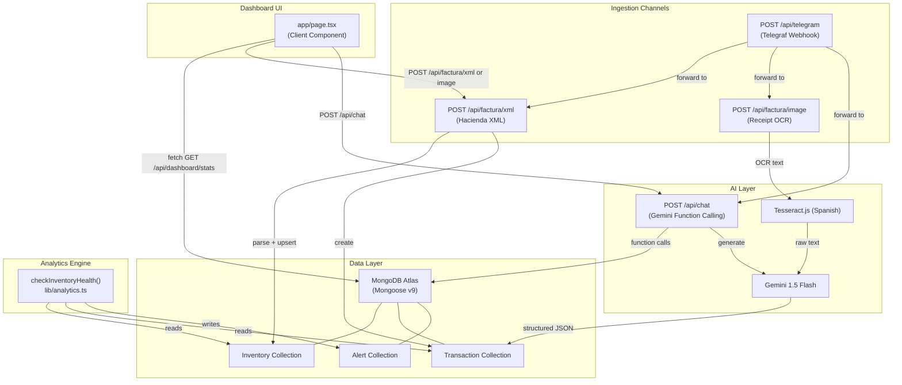

# Design Document: FacturaBot Hub

## Overview

FacturaBot Hub is an autonomous retail operations engine for Costa Rican businesses built as a single Next.js 16+ (App Router) application. It ingests electronic invoices (Hacienda XML, receipt images via OCR, and Telegram messages), maintains a live inventory and transaction ledger in MongoDB Atlas, and surfaces business intelligence through a Gemini-powered chat interface and a responsive dashboard.

The system has three ingestion channels (XML API, Image/OCR API, Telegram webhook), one AI reasoning layer (Gemini Function Calling chat), one analytics engine (`checkInventoryHealth`), and one unified dashboard UI. All channels converge on the same MongoDB collections, ensuring a single source of truth for inventory, transactions, and alerts.

Next.js 16 App Router conventions apply throughout: route handlers use the Web `Request`/`Response` APIs (not `NextRequest`/`NextResponse` unless extended features are needed), `params` and `searchParams` are Promises, and the dashboard page is a Client Component (`'use client'`) because it requires state, event handlers, and browser APIs (drag-and-drop, file input).

---

## Architecture

